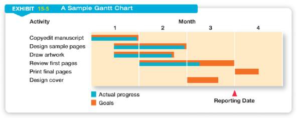
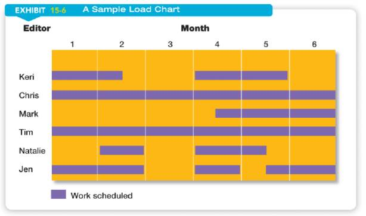
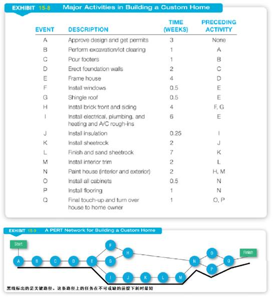

## 项目管理工具

#### 甘特图

甘特图以图示通过活动列表和时间刻度表示出特定项目的顺序与持续时间。一条线条图，横轴表示时间，纵轴表示项目，线条表示期间计划和实际完成情况。直观表明计划何时进行，进展与要求的对比。便于管理者弄清项目的剩余任务，评估工作进度。

甘特图是以作业排序为目的，将活动与时间联系起来的最早尝试的工具之一，帮助企业描述工作中心、超时工作等资源的使用。

甘特图包含以下三个含义：

1、以图形或表格的形式显示活动；

2、通用的显示进度的方法；

3、构造时含日历天和持续时间，不将周末节假算在进度内。

如图所示：

 

在RM21赛季中，我们使用甘特图对队伍各兵种的研发进度进行把控。

---

#### 负荷图

负荷图是一种修改了的甘特图，它不是在纵轴上列出活动，而是列出整个部门或某些特定的资源。通过检查负荷图中的负荷情况，可以使管理者明了哪些资源是满负荷的，哪些资源未得到充分使用，还可以加载工作量。负荷图可以使管理者计划和控制生产能力的利用情况。

如图所示：

 

在RM21赛季中，我们使用了改进版的负荷图。不仅在横轴上显示出负荷情况，更标出了当前人力资源承担的任务内容，从而更好地管理人力资源。

---

#### 计划评审技术(PERT)&关键路径法

计划评审技术(PERT)是用一种类似于流程图的图表展示完成项目所需各项活动的顺序以及每项活动所需时间和成本的技术。关键路径法是在计划评审技术(PERT)的基础上，生成路径图，识别关键路径，从而计算出完成任务所需的最短时间的方法。

如图所示：

 

在RM21赛季中，我们采用计划评审技术(PERT)&关键路径法来对各兵种的整体进度进行规划，并据此分配资源。
